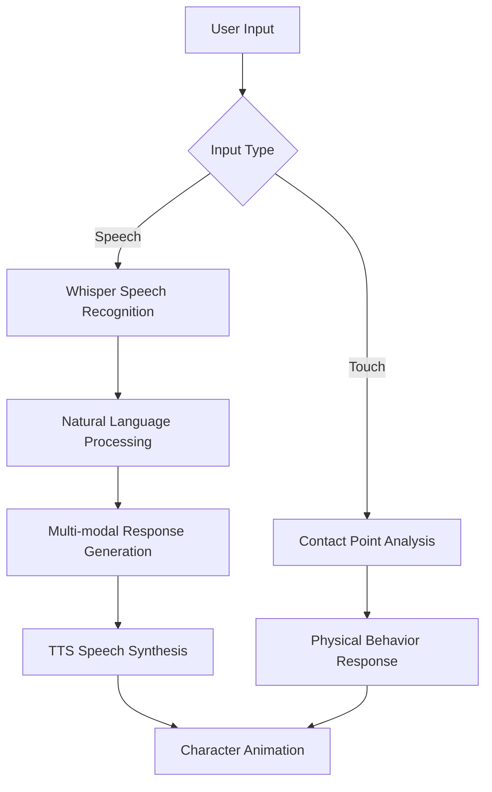
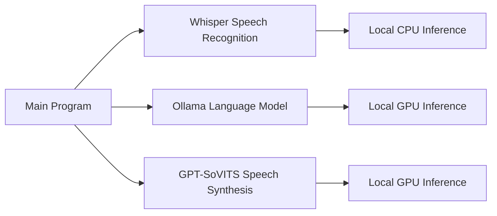

<div align="center">
    <h1 style="margin: 0;">🤖 AI Desktop Pet</h1>
    <br/>
    <b><a href="README.md">English</a></b> | <b><a href="README_zh.md">简体中文</a></b>
    <br/>
    <a href="api_usage.md">📚 API Documentation</a>
    <br/>
</div>

---

> [!CAUTION]
> The program's kernel is updating...
> 
> The in-program kernel update package relates to the programming language for plugins and extensions. The programming language will be replaced with our self-developed one (of course, Python and other languages are still supported). This new programming language is designed for regular users.
> 
> Supported for `Chinese Programming`

---

> [!IMPORTANT]
> **本程序二次开发唯二协议：**
> 
> 1、二次开发即Fork分支不得使用 官方 模型/插件 下载API（`https://api.nekcode.top/model/*` 和 `https://api.nekocode.top/plugin/*` ） 其余 API 下载更新，公告等分支均可使用！
> 
> 2、二次开发即Fork分支需提及本项目
> 
> **The only two protocols for secondary development of this program:**
> 
> 1. Forked branches resulting from secondary development must not use the official model/plugin download APIs (`https://api.nekcode.top/model/*` and `https://api.nekocode.top/plugin/*`). All other APIs, including those for downloading updates and announcements, may be used freely.
> 2. Forked branches resulting from secondary development must mention this project.
> 
> **本プログラムの二次開発に関する唯二の規約：**
> 
> 1. 二次開発によりフォークされたブランチは、「公式」モデル／プラグインのダウンロード用API（`https://api.nekcode.top/model/*` および `https://api.nekocode.top/plugin/*`）を使用してはなりません。その他のAPI（アップデートやお知らせなど）については自由に使用可能です。
> 2. 二次開発によるフォークされたブランチは、本プロジェクトを明記する必要があります。
> 
> **Le uniche due regole per lo sviluppo secondario di questo programma:**
> 
> 1. Le ramificazioni (fork) derivanti da sviluppi secondari non devono utilizzare le API ufficiali per il download di modelli/plugin (`https://api.nekcode.top/model/*` e `https://api.nekocode.top/plugin/*`). Tutte le altre API, incluse quelle per scaricare aggiornamenti e annunci, possono essere utilizzate liberamente.
> 2. Le ramificazioni derivanti da sviluppi secondari devono menzionare esplicitamente questo progetto.
> 
> **Les deux seules règles pour le développement secondaire de ce programme :**
> 
> 1. Les forks issus d'un développement secondaire ne doivent pas utiliser les API officielles de téléchargement des modèles/plugins (`https://api.nekcode.top/model/*` et `https://api.nekocode.top/plugin/*`). Toutes les autres API, y compris celles pour télécharger des mises à jour ou des annonces, peuvent être utilisées librement.
> 2. Les forks issus du développement secondaire doivent faire mention de ce projet.
> 
> **Die einzigen beiden Regeln für die sekundäre Entwicklung dieses Programms:**
> 
> 1. Bei der sekundären Entwicklung entstandene Forks dürfen die offiziellen Model-/Plugin-Download-APIs (`https://api.nekcode.top/model/*` und `https://api.nekocode.top/plugin/*`) nicht verwenden. Alle anderen APIs, einschließlich solcher zum Herunterladen von Updates oder Ankündigungen, können frei verwendet werden.
> 2. Bei der sekundären Entwicklung entstandene Forks müssen dieses Projekt erwähnen.

---


---

## 🌟 Project Overview

This is a cross-platform desktop pet driven by artificial intelligence, supporting highly customizable appearance and
interactive behaviors. The project employs a modular design, integrating the following core features:

- 🎭 Multi-form Character Support (2D Models)
- 🗣️ Intelligent Voice Interaction (Speech Recognition + NLP)
- ✨ Physics-Engine-Driven Realistic Behavior Simulation
- 🔌 Plugin-Based Extension System (Python)

---

## 🚀 Key Features

### 🌈 Interactive Features



---

## 🛠️ Quick Deployment

### System Requirements

#### Recommended System Requirements

- Windows 10/11 x64
- NVIDIA GPU (RTX 20 series or higher recommended)

#### Least Requirements

- Windows 10/11 x32
- i5-4 Series

### Installation Steps

1. Download the latest version from the [Releases page](https://github.com/HeavyNotFat/Agentic-AI-Desktop-Pet/releases)
2. Extract to the target directory (recommended to use an English path)
   ```bash
   Ai Desktop Pet.exe
   ```
3. API Key Configuration ([Guidelines](#-api-key-configuration))

---

## 🔑 API Key Configuration

### Alibaba Cloud Bailian Large Model

1. Log in to the [Bailian Console](https://bailian.console.aliyun.com/)
2. Create an application → Obtain API Key
3. Fill in the configuration → AI → Cloud Inference

### Xunfei Speech Service

1. Log in to the [Xunfei Cloud Console](https://www.xfyun.cn/)
2. Create a `Streaming Speech Recognition` application → Obtain API Information
3. Fill in the configuration → AI → Cloud Inference

---

## 🧩 Plugin Development

### Official Plugin Market

| Plugin Name    | Description                            | Version |
|----------------|----------------------------------------|---------|
| Plugin Manager | Manage installed plugins               | 0.0.2   |
| Raising System | Intelligent Training and Growth System | 0.5.0   |

---

<div align="center">
    <h2>🔧 Local Deployment Guide</h2>
    <h3>🚨 Important Note: Local deployment requires <i>1.42GB</i> for BASIC RUNTIME</h3>
    <h3>⚠️ The least space requirement is <i>3.22GB for FULL</i></h3>
</div>

---

## 🌐 Service Architecture Topology



---

## 🎙️ Speech Recognition Deployment (Whisper)

### 📦 Environment Setup

```bash
# Enter the driver directory
cd AA-package-driver

# Install dependencies (recommended to use a virtual environment)
python -m venv .venv
.venv\Scripts\activate
pip install -r requirements.txt
```

### 🚀 Start the Service

```bash
python Whisper_api.py
```

---

## 🗣️ Speech Synthesis Deployment (GPT-SoVITS)

### 📂 Model Directory Structure

```bash
gsv/
├── Chocolate;ja/
│   ├── ご主人様のお父様にいつかうまいって言わせてみせるって.wav
│   ├── Chocolate-e60.ckpt
│   └── Chocolate_e10_s3600.pth
└── Maple;ja/
    ├── ところで、花椒。パンプキンケーキに合わせて茶葉を選んでみたけど。.wav
    ├── Maple-e100.ckpt
    └── Maple_e10_s4510.pth
```

### ⚠️ Key Requirements

1. Folder naming format: `Character Name;Language Code` (e.g., `Chocolate;ja`)
2. WAV file names must match the complete text content of the corresponding speech
3. Must include the following three file types:
    - `.wav` reference audio
    - `.pth` generation model
    - `.ckpt` fine-tuning weights

---

## 🤖 Local Large Model Deployment (Ollama)

### 🛠️ Installation and Configuration

1. Download the [Ollama Windows version](https://ollama.com/download)
2. Set environment variables (optional):
   ```powershell
   # Modify the model storage path
   [Environment]::SetEnvironmentVariable("OLLAMA_MODELS", "<Your Model Path>", "User")
   ```
3. Restart the terminal to apply the configuration

### 🧠 Recommended Model Configurations

> [!WARNING]
> All the command must run on `Windows PowerShell` platform

| VRAM Capacity | Recommended Model | Startup Command           |
|---------------|-------------------|---------------------------|
| 1-4GB         | Qwen2.5-0.5B      | `ollama run qwen2.5:0.5b` |
| 4-6GB         | Qwen2.5-1.5B      | `ollama run qwen2.5:1.5b` |
| 6-9GB         | Qwen2.5-3B        | `ollama run qwen2.5:3b`   |
| 9-15GB        | Qwen2.5-7B        | `ollama run qwen2.5:7b`   |
| 18-22GB       | Qwen2.5-14B       | `ollama run qwen2.5:14b`  |
| 22-26GB       | Qwen2.5-32B       | `ollama run qwen2.5:32b`  |

---

## 🔄 API Interface Configuration

### 📡 Server Endpoint Settings

```json
{
  "api": "heavynotfat",
  "model": "qwen2.5:3b",
  "messages": "{{messages}}",
  "tools": "{{tools}}",
  "Answer Index": "message.content"
}
```

[API Configuration Screenshot](./github-show/textAPI.png)

### 🔑 Key Field Descriptions


| Field          | Required | Description                                        |
|----------------|----------|----------------------------------------------------|
| `messages`     | ✓        | Chat history (automatically filled by the program) |
| `Answer Index` | ✓        | Response parsing path (e.g., `message.content`)    |
| `Model`        | ✓        | Model name                                         |
| `API-Key`      | x        | API key                                            |
| `tools`        | x        | Available tools list (in JSON format)              |

---

## 📜 Open Source License

This project uses the **GPL-3.0 License**, with the following key restrictions:

- Modified code must be open-sourced
- Derivative works must explicitly credit the original copyright
- Cannot be used for military purposes

For commercial use, contact the author to obtain a commercial license.

---

<div align="center">
    <p>📧 Contact Developer: 2953911716@qq.com</p>
    <p>🌐 Official Community: https://github.com/HeavyNotFat/Agentic-AI-Desktop-Pet/discussions</p>
</div>
