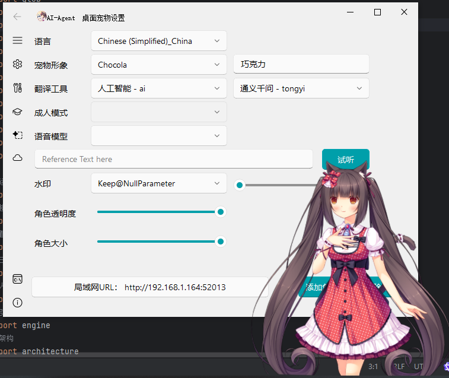
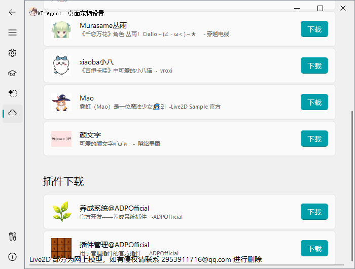
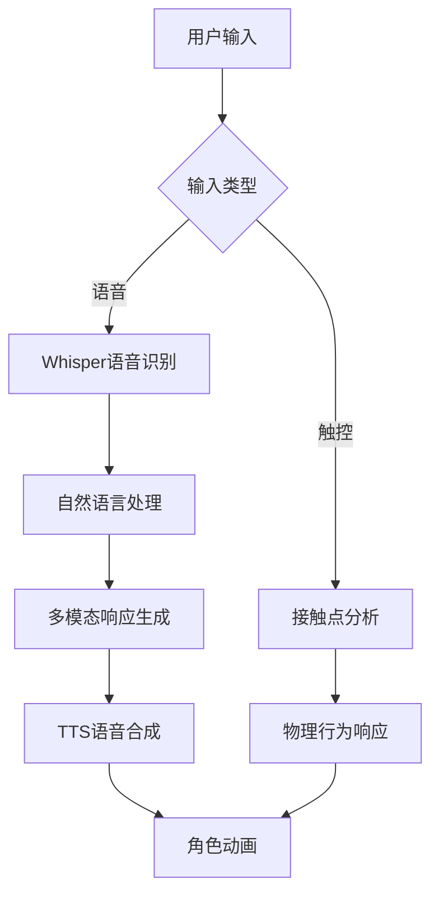
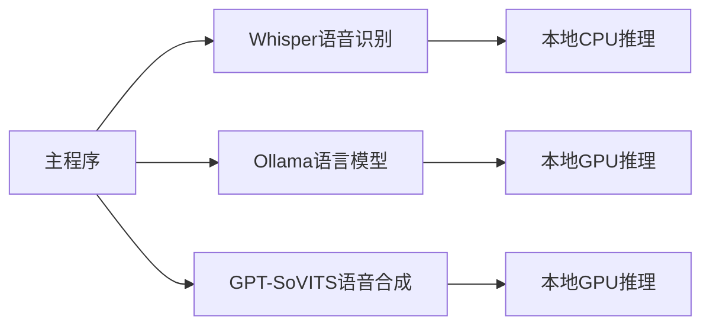
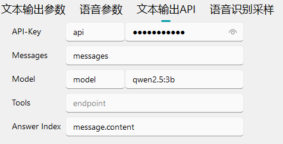

<div align="center">
    <h1 style="margin: 0;">🤖 人工智能桌面宠物</h1>
    <br/>
    <b><a href="README.md">English</a></b> | <b><a href="README_zh.md">简体中文</a></b>
    <br/>
    <a href="api_usage.md">📚 程序开放API文档</a>
    <br/>
</div>




---

## 🌟 项目简介

这是一个由人工智能驱动的跨平台桌面宠物，支持高度自定义外观与交互行为。项目采用模块化设计，集成以下核心功能：

- 🎭 多形态角色支持（2D模型）
- 🗣️ 智能语音交互（语音识别+自然语言处理）
- ✨ 物理引擎驱动的拟真行为模拟
- 🔌 插件式扩展系统（Python）

---

## 🚀 核心特性

### 🌈 交互功能



---

## 🛠️ 快速部署

### 系统要求

- Windows 10/11 x64
- NVIDIA GPU (推荐RTX 20系列以上)

### 安装步骤

1. 从 [Releases页面](https://github.com/HeavyNotFat/Agentic-AI-Desktop-Pet/releases) 下载最新版本
2. 解压到目标目录（建议使用英文路径）
   ```bash
   Ai Desktop Pet.exe
   ```
3. API密钥配置（[获取指南](#-api密钥配置)）

---

## 🔑 API密钥配置

### 阿里云百炼大模型

1. 登录 [百炼控制台](https://bailian.console.aliyun.com/)
2. 创建应用 → 获取API Key
3. 填入配置 → 人工智能 → 云端推理

### 讯飞语音服务

1. 登录 [讯飞云控制台](https://www.xfyun.cn/)
2. 创建 `语音听写（流式版）` 应用 → 获取 API 信息
3. 填入配置 → 人工智能 → 云端推理

---

## 🧩 插件开发

### 插件市场 - 官方

| 插件名称 | 功能描述      | 版本    |
|------|-----------|-------|
| 插件管理 | 管理已安装插件   | 0.0.2 |
| 养成系统 | 智能训练与成长系统 | 0.5.0 |

---

<div align="center">
    <h2>🔧 本地化部署指南</h2>
    <h3>🚨 重要提示：本地部署需 <i>1.42GB</i> 以上可用存储空间</h3>
</div>


## 🌐 服务架构拓扑



---

## 🎙️ 语音识别部署（Whisper）

### 📦 环境配置

```bash
# 进入驱动目录
cd AA-package-driver

# 安装依赖（推荐使用虚拟环境）
python -m venv .venv
.venv\Scripts\activate
pip install -r requirements.txt
```

### 🚀 启动服务

```bash
python Whisper_api.py
```
---

## 🗣️ 语音合成部署（GPT-SoVITS）

### 📂 模型目录结构

```bash
gsv/
├── 巧克力;ja/
│   ├── ご主人様のお父様にいつかうまいって言わせてみせるって.wav
│   ├── 巧克力-e60.ckpt
│   └── 巧克力_e10_s3600.pth
└── 枫;ja/
    ├── ところで、花椒。パンプキンケーキに合わせて茶葉を選んでみたけど。.wav
    ├── 枫-e100.ckpt
    └── 枫_e10_s4510.pth
```

### ⚠️ 关键要求

1. 文件夹命名格式：`角色名;语言代码`（如：`巧克力;ja`）
2. WAV文件名必须为对应语音的**完整文本内容**
3. 必须包含以下三种文件类型：
    - `.wav` 参考音频
    - `.pth` 生成模型
    - `.ckpt` 微调权重

---

## 🤖 本地大模型部署（Ollama）

### 🛠️ 安装配置

1. 下载 [Ollama Windows版本](https://ollama.com/download)
2. 设置环境变量（可选）：
   ```powershell
   # 修改模型存储路径
   [Environment]::SetEnvironmentVariable("OLLAMA_MODELS", "<你的模型路径>", "User")
   ```
3. 重启终端使配置生效

### 🧠 模型推荐配置

| 显存容量   | 推荐模型       | 启动命令                      |
|--------|------------|---------------------------|
| 4-6GB  | Qwen2-0.5B | `ollama run qwen2.5:0.5b` |
| 6-8GB  | Qwen2-1.8B | `ollama run qwen2.5:1.8b` |
| 8-12GB | Qwen2-7B   | `ollama run qwen2.5:7b`   |
| 12GB+  | Qwen2-72B  | `ollama run qwen2.5:72b`  |

---

## 🔄 API接口配置

### 📡 服务端点设置

```json
{
  "api": "heavynotfat",
  "model": "qwen2.5:3b",
  "messages": "{{messages}}",
  "tools": "{{tools}}",
  "Answer Index": "message.content"
}
```



### 🔑 关键字段说明

| 字段             | 必须 | 说明                           |
|----------------|----|------------------------------|
| `messages`     | ✓  | 对话历史（由程序自动填充）                |
| `Answer Index` | ✓  | 响应解析路径（示例：`message.content`） |
| `Model`        | ✓  | 模型名称                         |
| `API-Key`      | ✓  | API密钥                        |
| `tools`        | x  | 可用工具列表（JSON格式）               |

## 📜 开源协议

本项目采用 **GPL-3.0 License**，核心限制包括：

- 修改代码必须开源
- 衍生作品需明确标注原始版权
- 不得用于军事用途

商业使用请联系作者获取商业授权。

---

<div align="center">
    <p>📧 联系开发者: 2953911716@qq.com</p>
    <p>🌐 官方社区: https://github.com/HeavyNotFat/Agentic-AI-Desktop-Pet/discussions</p>
</div>